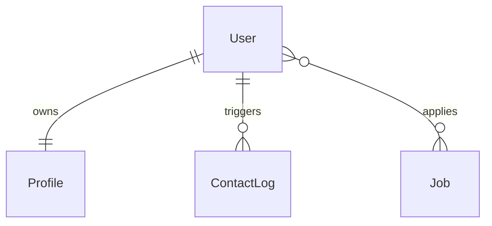

# Naukari Bazaar Database Schema Specification

This document details the MongoDB collections, mongoose schemas, field rules, types, and indexes implemented in the Naukari Bazaar backend database.

---

## 1. Collection Overview

The database uses MongoDB with Mongoose ODM to enforce the following schema structures:
* `users` - Base authentication details and application states.
* `profiles` - Detailed wizard information containing sub-documents.
* `contact_logs` - Interaction tracking logs for recruiter call & WhatsApp redirections.
* `jobs` - Seeding and job catalog listings.

---

## 2. Collections and Fields

### 2.1 Collection: `users`
Tracks core user records, login verification status, and wizard completeness.

* **Indexes:**
  * `phone: 1` (Unique, Ascending) - Speeds up registration lookup and OTP routing.

* **Fields:**
  | Field Name | Type | Required | Default | Notes |
  | :--- | :--- | :--- | :--- | :--- |
  | `_id` | ObjectId | Yes | *Auto* | MongoDB standard identifier |
  | `phone` | String | Yes | *None* | Unique 10-digit mobile number |
  | `isPhoneVerified`| Boolean | No | `false` | Status of SMS OTP confirmation |
  | `registrationStatus`| String | No | `'PENDING'` | Enum: `['PENDING', 'COMPLETED']` |
  | `registrationComplete`| Boolean | No | `false` | Sync state for mobile front-end bypass |
  | `language` | String | No | `'en'` | Preference code: `['en', 'hi', 'mr']` |
  | `createdAt` | Date | No | *Now* | Autogenerated timestamp |
  | `updatedAt` | Date | No | *Now* | Autogenerated timestamp |

---

### 2.2 Collection: `profiles`
Holds the user's complete profile information collected via the 5-step wizard.

* **Indexes:**
  * `user: 1` (Unique) - Ensures a strict one-to-one user-profile integrity.
  * `registrationNo: 1` (Unique) - Quick indexing for official administrative checks.

* **Fields:**
  | Field Name | Type | Required | Default | Notes |
  | :--- | :--- | :--- | :--- | :--- |
  | `_id` | ObjectId | Yes | *Auto* | MongoDB standard identifier |
  | `user` | ObjectId | Yes | *None* | Reference to `User` model |
  | `registrationNo` | String | No | *None* | Generated format: `NB-YYYY-XXXXX` |
  | `personal` | Object | No | *None* | Nested Personal details (see below) |
  | `address` | Object | No | *None* | Nested Address details (see below) |
  | `jobPreferences`| Object | No | *None* | Nested Preference details (see below) |
  | `education` | Object | No | *None* | Nested Education details (see below) |
  | `experience` | Object | No | *None* | Nested Experience details (see below) |
  | `completionPercentage`| Number | No | `0` | Calculated dynamically from active fields |
  | `appliedJobs` | Array | No | `[]` | Array of references to `Job` collection |

#### Nested Sub-schemas:
* **`personal` sub-schema:**
  * `firstName`: String (Required)
  * `lastName`: String (Required)
  * `gender`: String (Enum: `['Male', 'Female', 'Other']`)
  * `dob`: String (Format: `DD-MM-YYYY`)

* **`address` sub-schema:**
  * `state`: String (Required)
  * `city`: String (Required)
  * `district`: String
  * `pincode`: String (Length: 6 digits)

* **`jobPreferences` sub-schema:**
  * `categories`: `[String]` (Required, min length: 1)
  * `salaryRange`: String (Required)
  * `shiftPreference`: String (Enum: `['Day Shift', 'Night Shift', 'Any Shift']`)
  * `immediatelyAvailable`: Boolean (Default: `true`)

* **`education` sub-schema:**
  * `level`: String (Required)
  * `schoolName`: String
  * `passingYear`: Number

* **`experience` sub-schema:**
  * `hasExperience`: Boolean (Required)
  * `years`: Number
  * `previousJobTitle`: String
  * `previousCompany`: String

---

### 2.3 Collection: `contact_logs`
Tracks analytics when a user clicks the call support or WhatsApp support recruiters buttons.

* **Indexes:**
  * `userId: 1` - Filters support contacts by specific users.
  * `createdAt: 1` - Sorts contact logs chronologically.

* **Fields:**
  | Field Name | Type | Required | Default | Notes |
  | :--- | :--- | :--- | :--- | :--- |
  | `_id` | ObjectId | Yes | *Auto* | MongoDB standard identifier |
  | `userId` | ObjectId | Yes | *None* | Reference to `User` model |
  | `actionType` | String | Yes | *None* | Enum: `['CALL', 'WHATSAPP']` |
  | `device` | String | No | `'Unknown'` | Extracted device code (e.g. `Android`, `iPhone`) |
  | `platform` | String | No | `'unknown'` | Extracted OS name (e.g. `ios`, `android`) |
  | `createdAt` | Date | No | *Now* | Timestamp of redirection click |

---

### 2.4 Collection: `jobs`
Catalog of jobs seeded into the database, used for matching recommendations.

* **Indexes:**
  * `category: 1` - Optimizes recommendation indexing.

* **Fields:**
  | Field Name | Type | Required | Default | Notes |
  | :--- | :--- | :--- | :--- | :--- |
  | `_id` | ObjectId | Yes | *Auto* | MongoDB standard identifier |
  | `title` | String | Yes | *None* | Job role title |
  | `company` | String | Yes | *None* | Hiring employer business name |
  | `location` | String | Yes | *None* | Work location city/area |
  | `salary` | String | Yes | *None* | Remuneration text range |
  | `category` | String | Yes | *None* | Category code (e.g. `Construction`, `Security`) |
  | `type` | String | Yes | *None* | Job nature (e.g. `Full Time`, `Part Time`) |
  | `description` | String | No | *None* | Detailed requirements description |
  | `isVerified` | Boolean | No | `true` | Badging toggle |
  | `urgentHiring`| Boolean | No | `false` | Highlight badging toggle |
  | `postedAt` | Date | No | *Now* | Seeding or creation timestamp |
